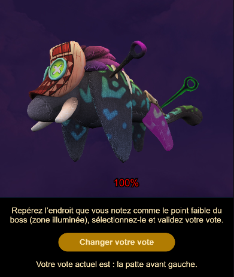

# CUBI19-UQAC2-TwitchExtension
This repo is about the creation of a Twitch Extension that can manage interactions between the streamer and the viewers for our entry of the Ubisoft 2019 Game Lab Competition.

## Front-End

The actual Twitch Extension, it handles the display of the 3D model, the user inputs and its transmission to the EBS.
It also handles receiving PubSub messages from the EBS, mainly to be synced to the game status.

## Back-End

The EBS, it holds the data structure that contains the votes and game status, and manages communications between the game and the Twitch Extension.